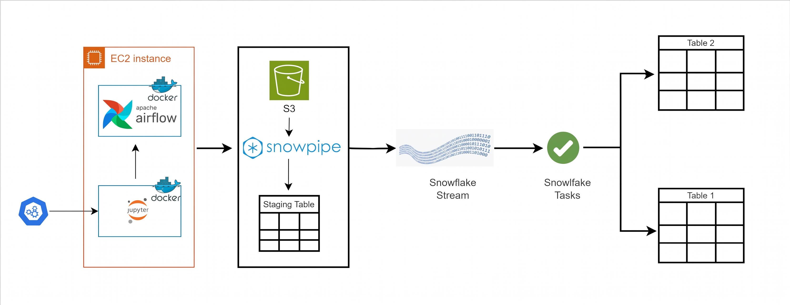
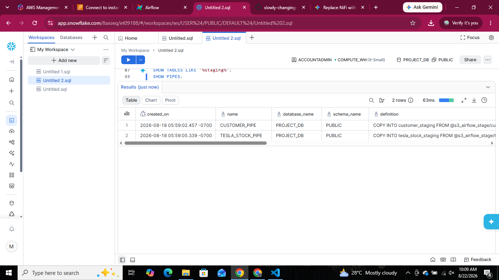
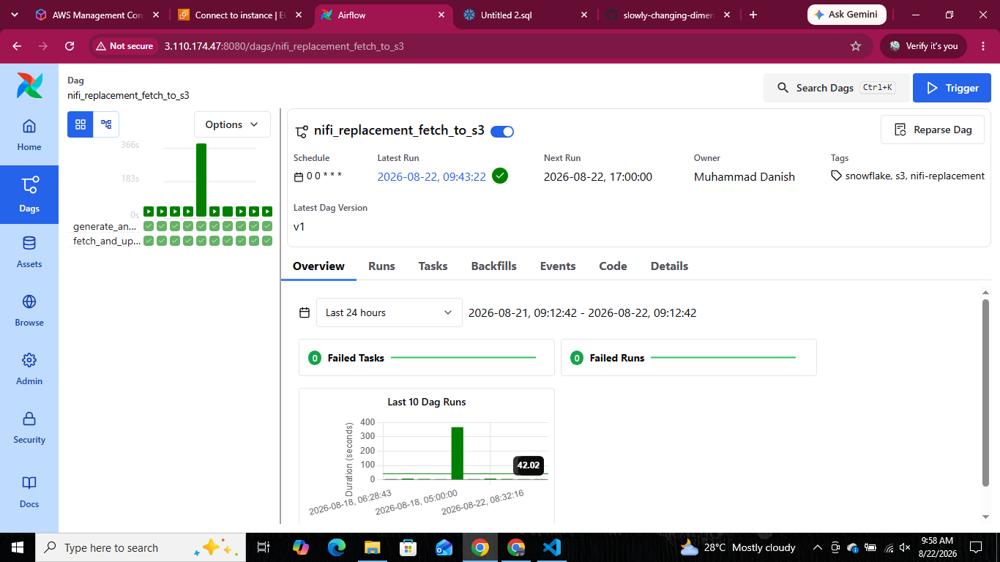
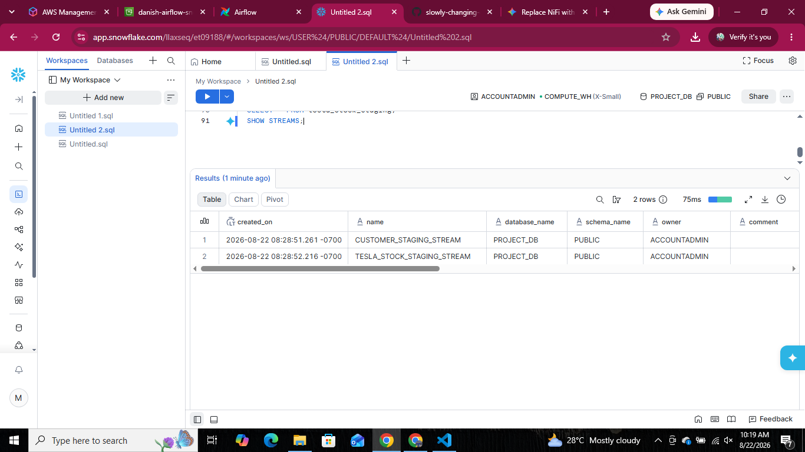
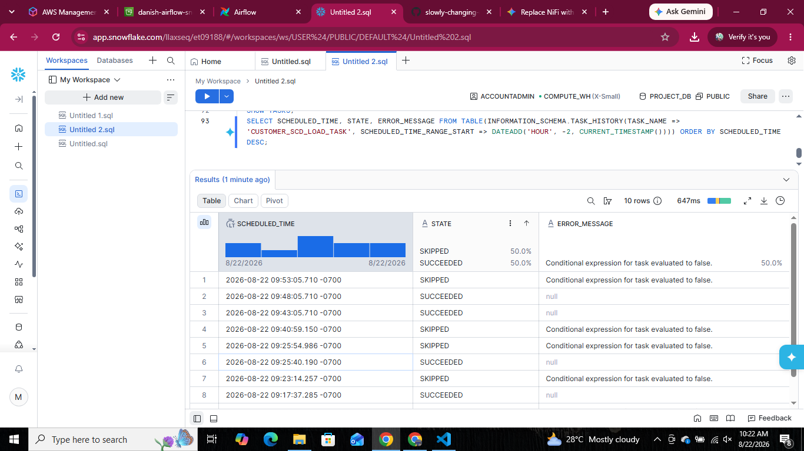

# Airflow → S3 → Snowflake Automated SCD Pipeline

A fully automated data pipeline that generates synthetic customer data and live Tesla stock data, uploads it to S3, auto-ingests it into Snowflake via Snowpipe, tracks changes with Streams, and loads it into SCD Type 2 dimension tables using scheduled Tasks — with zero manual intervention after setup.

This project replaces a traditional **Apache NiFi**-based ingestion flow with an **Apache Airflow (Dockerized on EC2)** orchestration layer feeding into a modern **Snowflake-native ELT pipeline**.

---

## Architecture.



**Flow:** `Airflow (Docker on EC2) → S3 → Snowpipe → Staging Tables → Snowflake Stream → Snowflake Task (every 5 min) → Final Tables`

| Stage | Component | Purpose |
|---|---|---|
| 1 | **Airflow** | Generates fake customer records (Faker) + fetches live TSLA stock data (yfinance); uploads both as CSV to S3 |
| 2 | **S3** | Raw landing zone — `customer_data/` and `tesla_stock/` prefixes |
| 3 | **Snowpipe** | Auto-ingests new S3 files into staging tables via SQS event notifications |
| 4 | **Staging Tables** | Raw, untransformed landing tables in Snowflake |
| 5 | **Streams** | Track row-level inserts on staging tables since last consumption |
| 6 | **Tasks** | Scheduled every 5 minutes — merge stream data into final tables |
| 7 | **Final Tables** | `customer_dim` (SCD Type 2) and `tesla_stock_fact` |

---

## Tech Stack

- **Orchestration:** Apache Airflow 3.0.4 (Docker Compose, on AWS EC2 / Ubuntu)
- **Data generation:** Faker (customers), yfinance (Tesla stock)
- **Storage:** AWS S3
- **Warehouse:** Snowflake (Storage Integration, Snowpipe, Streams, Tasks)
- **Language:** Python, SQL

---

## Infrastructure Setup

### EC2 Instance

Airflow runs inside Docker containers on an **AWS EC2 (Ubuntu)** instance.

- **Instance connection:** SSH via key pair (`.pem` file), connected here through VS Code's Remote development (`ssh -i "SCD.pem" ubuntu@<ec2-public-ip>`)
- **Region:** ap-south-1
- ⚠️ Public IP changes on every instance stop/start unless an Elastic IP is attached — reconnect with the current IP shown in the EC2 console.

### Docker Compose — Airflow Stack

Official Airflow `docker-compose.yaml` (CeleryExecutor), running these services:

| Container | Role |
|---|---|
| `airflow-apiserver` | Web UI, port `8080` |
| `airflow-scheduler` | Schedules DAG runs |
| `airflow-dag-processor` | Parses DAG files |
| `airflow-worker` | Executes tasks |
| `airflow-triggerer` | Handles deferred/async tasks |
| `postgres` | Airflow metadata DB |
| `redis` | Celery broker |

```bash
cd ~/airflow
docker compose up -d
docker ps          # confirm all containers are "healthy"
```

Extra Python packages (`boto3`, `faker`, `yfinance`) are installed via `_PIP_ADDITIONAL_REQUIREMENTS` in `.env`, so they persist across container rebuilds.

### Accessing the Airflow UI

```
http://<ec2-public-ip>:8080
```

Security Group inbound rule required: **Custom TCP, port 8080**, source = your IP (or `0.0.0.0/0` for open testing).

---

## Pipeline Setup

### 1. AWS ↔ Snowflake Storage Integration

Secure, key-less connection between Snowflake and the S3 bucket using an IAM role trust relationship.


### 2. File Format + External Stage

```sql
CREATE OR REPLACE FILE FORMAT csv_file_format
  TYPE = 'CSV'
  FIELD_DELIMITER = ','
  SKIP_HEADER = 1
  NULL_IF = ('NULL', 'null')
  EMPTY_FIELD_AS_NULL = TRUE;

CREATE OR REPLACE STAGE s3_airflow_stage
  URL = 's3://danish-airflow-snowflake-2026/'
  STORAGE_INTEGRATION = s3_airflow_integration
  FILE_FORMAT = csv_file_format;
```


### 3. Verifying the Stage

```sql
LIST @s3_airflow_stage;
```

Confirms Snowflake can see the files Airflow uploaded to S3.


### 4. Staging Tables

Two raw landing tables — one per data source:

```sql
CREATE OR REPLACE TABLE customer_staging (
    customer_id INT,
    first_name STRING,
    last_name STRING,
    email STRING,
    street STRING,
    city STRING,
    state STRING,
    country STRING
);

CREATE OR REPLACE TABLE tesla_stock_staging (
    date_col STRING,
    open_price FLOAT,
    high_price FLOAT,
    low_price FLOAT,
    close_price FLOAT,
    volume FLOAT,
    dividends FLOAT,
    stock_splits FLOAT
);
```


### 5. Snowpipes (Auto-Ingest)

```sql
CREATE OR REPLACE PIPE customer_pipe
  AUTO_INGEST = TRUE
AS
COPY INTO customer_staging
FROM @s3_airflow_stage/customer_data/
FILE_FORMAT = (FORMAT_NAME = csv_file_format);

CREATE OR REPLACE PIPE tesla_stock_pipe
  AUTO_INGEST = TRUE
AS
COPY INTO tesla_stock_staging
FROM @s3_airflow_stage/tesla_stock/
FILE_FORMAT = (FORMAT_NAME = csv_file_format);
```



The `notification_channel` (SQS ARN) from `SHOW PIPES;` was registered as an S3 Event Notification so that every new file automatically triggers ingestion — no polling, no manual `COPY INTO`.


### 6. Airflow DAG

The `nifi_replacement_fetch_to_s3` DAG runs daily (and on-demand) with two parallel tasks:

- `generate_and_upload_customers` — generates 1,000 fake customer records with Faker
- `fetch_and_upload_tesla_stock` — pulls the last 5 days of TSLA OHLCV data via yfinance



### 7. Auto-Ingest Proof

New data lands in the staging tables automatically within seconds of the DAG run completing — no manual `COPY INTO` required.


---

## Change Tracking & Automation

### Streams

```sql
CREATE OR REPLACE STREAM customer_staging_stream ON TABLE customer_staging;
CREATE OR REPLACE STREAM tesla_stock_staging_stream ON TABLE tesla_stock_staging;
```

Streams track every new row inserted into the staging tables since the last time a Task consumed them.



### Tasks

Two scheduled Tasks run every 5 minutes and only fire when their stream has unconsumed data (`SYSTEM$STREAM_HAS_DATA`):

- **`tesla_stock_load_task`** — simple append into `tesla_stock_fact`
- **`customer_scd_load_task`** — SCD Type 2 merge into `customer_dim`

```sql
CREATE OR REPLACE TASK customer_scd_load_task
  WAREHOUSE = COMPUTE_WH
  SCHEDULE = '5 MINUTE'
WHEN
  SYSTEM$STREAM_HAS_DATA('customer_staging_stream')
AS
BEGIN
    CREATE OR REPLACE TEMPORARY TABLE customer_changes AS
    SELECT * FROM (
        SELECT *, ROW_NUMBER() OVER (PARTITION BY customer_id ORDER BY METADATA$ROW_ID DESC) AS rn
        FROM customer_staging_stream
        WHERE METADATA$ACTION = 'INSERT'
    ) WHERE rn = 1;

    UPDATE customer_dim AS target
    SET target.end_date = CURRENT_TIMESTAMP(), target.is_current = FALSE
    FROM (
        SELECT c.customer_id FROM customer_changes c
        JOIN customer_dim d ON c.customer_id = d.customer_id AND d.is_current = TRUE
        WHERE c.first_name != d.first_name OR c.city != d.city OR c.state != d.state
           OR c.street != d.street OR c.email != d.email OR c.country != d.country
    ) changed
    WHERE target.customer_id = changed.customer_id AND target.is_current = TRUE;

    INSERT INTO customer_dim (customer_id, first_name, last_name, email, street, city, state, country, start_date, end_date, is_current)
    SELECT c.customer_id, c.first_name, c.last_name, c.email, c.street, c.city, c.state, c.country,
           CURRENT_TIMESTAMP(), NULL, TRUE
    FROM customer_changes c
    LEFT JOIN customer_dim d ON c.customer_id = d.customer_id AND d.is_current = TRUE
    WHERE d.customer_id IS NULL;
END;
```



---

## SCD Type 2 — Proof of History Preservation

The core goal of this project: when a customer's data changes, the old record is **expired** (not overwritten) and a **new current record** is inserted — preserving full history.

```sql
SELECT customer_sk, customer_id, first_name, city, state, is_current, start_date, end_date
FROM customer_dim
WHERE customer_id = 0
ORDER BY customer_sk;
```

| customer_sk | customer_id | first_name | city | state | is_current | end_date |
|---|---|---|---|---|---|---|
| 1 | 0 | Juan | Hooperberg | Hawaii | FALSE | 2026-08-22 09:17:38 |
| 11401 | 0 | Juan | Miami | Florida | TRUE | NULL |


### Final Tables

```sql
SELECT * FROM customer_dim LIMIT 10;
SELECT * FROM tesla_stock_fact;
```


---

## Bugs Found & Fixed

Building this pipeline surfaced three real, non-obvious bugs — each debugged from symptom to root cause.

| # | Symptom | Root Cause | Fix |
|---|---|---|---|
| 1 | `tesla_stock_staging` always 0 rows despite `Loaded` status | Old `yfinance==0.2.44` returning malformed API responses (`Expecting value: line 1 column 1`) | Upgraded to `yfinance==0.2.66` via `_PIP_ADDITIONAL_REQUIREMENTS` in `.env`, rebuilt containers |
| 2 | New Tesla data silently skipped by Snowpipe on retriggered runs | Airflow generated the same filename (`TSLA_{ds}.csv`) for same-day reruns; Snowpipe deduplicates by filename | Added a timestamp suffix: `TSLA_{ds}_{timestamp}.csv` — every run now produces a unique file |
| 3 | SCD Task only ever expired the old row, never inserted the new one | Each statement in a Snowflake multi-statement Task auto-commits, so the `UPDATE` consumed the stream before the `INSERT` could read it | Captured the stream into a temporary table once per task run; both `UPDATE` and `INSERT` read from that snapshot instead of the stream directly |

---

## Project Status

- [x] Storage Integration, File Format, External Stage
- [x] Staging tables
- [x] Snowpipe auto-ingest (both sources, verified end-to-end)
- [x] Streams (change tracking)
- [x] Tasks (scheduled, automated)
- [x] Final tables (`customer_dim` SCD Type 2, `tesla_stock_fact`)
- [x] SCD Type 2 logic tested and confirmed (expire + insert verified with real data)
- [x] End-to-end pipeline verified: Airflow trigger → S3 → Snowpipe → staging → stream → task → final table

**Result:** a self-healing, fully automated ELT pipeline requiring no manual `COPY INTO` or `MERGE` after initial setup.

---

## Author

**Muhammad Danish**
